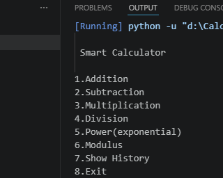
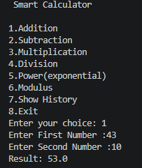
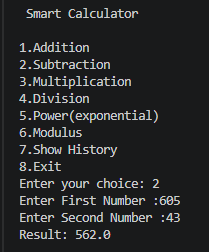
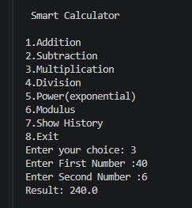
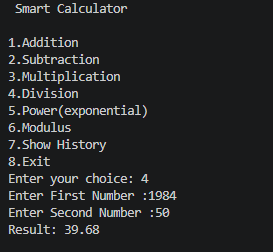
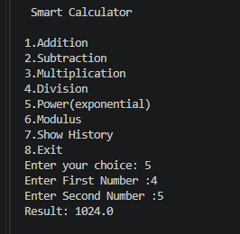
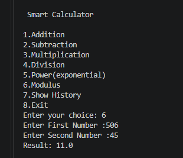
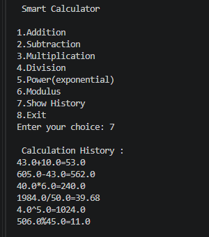

# 🧮 Smart Calculator (Python)

A command-line based Smart Calculator built using Python.  
This project performs multiple mathematical operations and keeps track of calculation history.

## 🚀 Features

- Addition  
- Subtraction  
- Multiplication  
- Division (with zero division handling)  
- Power (Exponential calculations)  
- Modulus  
- Calculation History tracking  
- User-friendly menu interface  
- Error handling for invalid inputs  

## 🛠️ Tech Used

- Python 3  
- VS Code  

## ▶️ How to Run

1. Install Python (if not installed)  
2. Download or clone this repository  
3. Open terminal in project folder  
4. Run the below command:
   python Calculator.py

## 📸 Output Screenshots

### 🔹 Menu

### 🔹 Addition

### 🔹 Subtraction

### 🔹 Multiplication

### 🔹 Division

### 🔹 Power

### 🔹 Modulus

### 🔹 History

## 📌 Project Highlights

- Built using basic Python concepts (functions, loops, conditionals)  
- Implements real-world logic with error handling  
- Clean and readable code structure  
- Beginner-friendly yet practical  

## 🎯 Future Improvements

- Add GUI using Tkinter  
- Add more advanced operations  
- Store history in a file  

## 🙋‍♀️ Author

**Sinchana G**

GitHub: https://github.com/sinchana-g7

⭐ If you like this project, give it a star!
